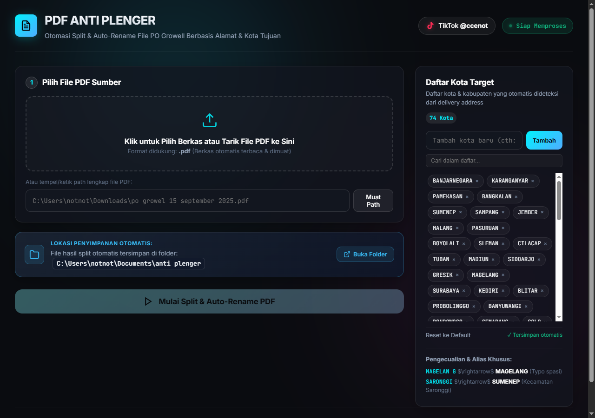
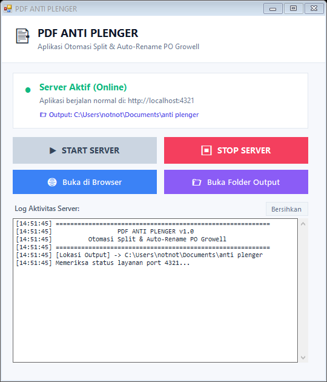

<div align="center">

# 📑 PDF ANTI PLENGER

### Otomasi Split & Auto-Rename Berkas PDF PO Berbasis Alamat & Kota Tujuan

[](https://nodejs.org/)
[](https://microsoft.com/windows)
[](https://www.tiktok.com/@ccenot)
[](LICENSE)

<br/>

**PDF ANTI PLENGER** adalah solusi otomasi pintar untuk memecah (*split*) dokumen PDF Purchase Order (PO) multi-halaman menjadi satu file per halaman dengan penamaan otomatis berformat:
`[NOMOR PO] [KOTA TUJUAN].pdf`

Dilengkapi dengan **Web Interface Modern (Dark Glassmorphic UI)** serta aplikasi kontrol desktop mandiri **`PDF_Anti_Plenger.exe`** (Pastel Aesthetic GUI).

</div>

---

## 📸 Tampilan Antarmuka & Showcase

<div align="center">

### 🌐 Web Interface (Dark Glassmorphic UI)
*Antarmuka web interaktif untuk drag & drop PDF, pemantauan progress real-time, dan manajemen daftar kota target.*

<br/>



<br/><br/>

### 🖥️ Desktop Launcher (`PDF_Anti_Plenger.exe`)
*Panel kontrol native Windows dengan tema Pastel Aesthetic — kontrol Start/Stop server, buka browser, dan buka folder output dalam 1 klik.*

<br/>



</div>

---

## ✨ Fitur Unggulan

- ⚡ **Lossless Vector Split**: Memecah halaman PDF tanpa mengubah kualitas resolusi / tetap teks vektor tajam menggunakan `pdf-lib`.
- 🧠 **Smart Text & Coordinate Parser**: Mengekstrak teks berdasarkan koordinat posisi $X$ dan $Y$ via `pdf2json`, memastikan pembacaan nomor PO dan alamat akurat meskipun layout padat.
- 🎯 **Deteksi Kota & Alamat Cerdas**:
  - Mengisolasi khusus blok **Delivery Address** (tidak tertipu dengan alamat supplier/NPWP).
  - Mendeteksi nama Kabupaten / Kota tujuan dari database kota yang dinamis.
  - Penanganan otomatis typo/alias (contoh: `MAGELAN G` $\rightarrow$ `MAGELANG`, `SARONGGI` $\rightarrow$ `SUMENEP`).
- 🖥️ **Aplikasi Desktop Launcher (`.exe`)**:
  - Tampilan **Pastel Aesthetic & Ringan**.
  - Tombol **Start** & **Stop** server dengan satu klik (tanpa jendela hitam CMD).
  - Tombol cepat **Buka di Browser** dan **Buka Folder Output**.
  - Monitor log server real-time.
- 🌐 **Web Interface Interaktif**:
  - Drag & Drop file PDF langsung ke browser.
  - Live Progress Bar per halaman & terminal konsol streaming realtime via Server-Sent Events (SSE).
  - Panel Tag/Chips untuk mengedit dan menambah nama kota target tanpa menyentuh kodingan.
  - Unduh rekap hasil pemecahan ke format **CSV / Excel**.
- 📂 **Penyimpanan Otomatis**:
  - Seluruh file hasil split otomatis masuk ke folder `Documents\anti plenger` pengguna.

---

## 🛠️ Arsitektur & Teknologi

| Komponen | Teknologi | Keterangan |
|---|---|---|
| **Core Engine** | `Node.js`, `pdf-lib`, `pdf2json` | Ekstraksi teks & pemotong PDF |
| **Backend Server** | Native Node.js HTTP Server | Endpoint API & SSE Stream |
| **Frontend Web** | HTML5, Vanilla CSS, Modern ES6 | Dark Glassmorphic Design |
| **Desktop Launcher** | C# .NET Windows Forms (`.exe`) | Kompatibel native Windows tanpa install tambahan |

---

## 🚀 Panduan Penggunaan

### Opsi A: Menggunakan Aplikasi Launcher (`.exe`) — *Paling Praktis*

1. Buka folder aplikasi dan jalankan:
   ```text
   PDF_Anti_Plenger.exe
   ```
2. Klik tombol **`▶ START SERVER`**.
3. Browser akan otomatis terbuka ke `http://localhost:4321`.
4. Di halaman web:
   - **Tarik / Pilih berkas PDF PO** Anda.
   - Klik tombol **"Mulai Split & Auto-Rename PDF"**.
5. Selesai! File hasil langsung tersimpan di:
   ```text
   📁 Documents\anti plenger
   ```
   *(Anda dapat klik tombol **"Buka Folder Output"** di aplikasi untuk langsung melihat hasilnya).*

---

### Opsi B: Menjalankan via Terminal / Pengembang (Developer Mode)

1. **Clone repository ini:**
   ```bash
   git clone https://github.com/ccenot/pdf-anti-plenger.git
   cd pdf-anti-plenger
   ```

2. **Instal dependensi:**
   ```bash
   npm install
   ```

3. **Jalankan server aplikasi:**
   ```bash
   npm start
   ```

4. Buka browser di [http://localhost:4321](http://localhost:4321).

5. *(Opsional)* Untuk mengompilasi ulang file `.exe` dari kode sumber `Launcher.cs`:
   ```cmd
   build_exe.bat
   ```

---

## 📁 Struktur Berkas Proyek

```text
pdf_splitter/
├── 📑 PDF_Anti_Plenger.exe       # GUI Launcher Desktop (.exe)
├── ⚙️ Launcher.cs                 # Kode sumber C# Windows Forms Launcher
├── ⚙️ build_exe.bat              # Script kompilasi ulang .exe
├── 🚀 app_server.js              # Server HTTP & SSE Realtime
├── 🧠 core_splitter.js            # Engine pemecah & pendeteksi kota
├── 📋 config.json                # Database daftar kota & preferensi
├── 📦 package.json               # Dependensi & script Node.js
├── 🌐 public/                    # Tampilan Frontend Web Interface
│   ├── index.html                # Struktur halaman web
│   ├── style.css                 # Styling Dark Glassmorphic
│   └── app.js                    # Logika interaktif & SSE handler
├── 📖 PANDUAN_PENGGUNAAN.txt      # Panduan ringkas pengguna
└── 📄 README.md                  # Dokumentasi utama proyek
```

---

## 👨‍💻 Kreator & Kontak

Dibuat dengan ❤️ oleh **Cenot**

- 🎵 **TikTok**: [@ccenot](https://www.tiktok.com/@ccenot)
- 🌐 **GitHub**: [@ccenot](https://github.com/ccenot)

---

<div align="center">
  <sub>PDF ANTI PLENGER • Anti ribet, anti pusing, kerjaan beres sekali klik! 🚀</sub>
</div>
